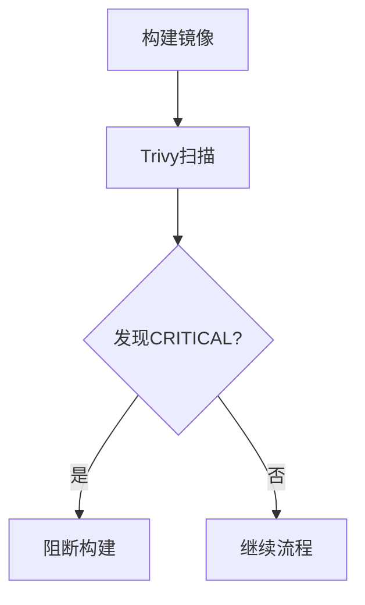
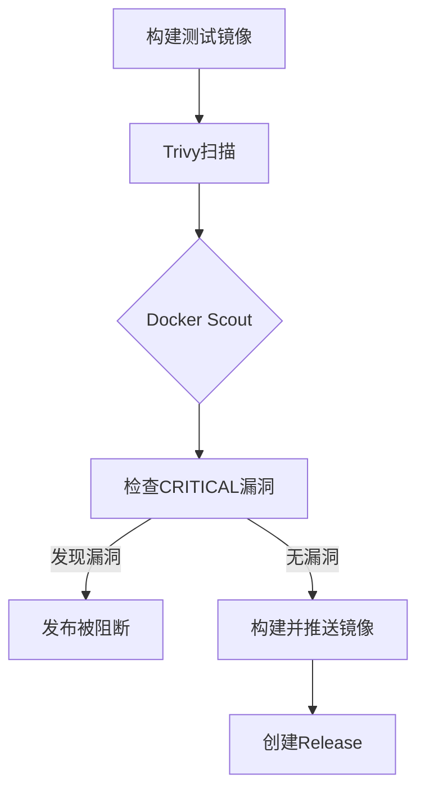
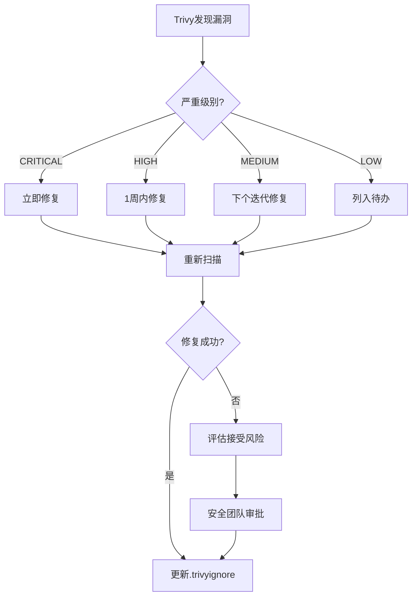

# Docker 镜像安全扫描配置指南

本文档描述了百姓助手项目的Docker镜像安全扫描机制，包括扫描工具配置、CI/CD集成流程和安全加固措施。

## 目录

1. [安全扫描工具](#安全扫描工具)
2. [CI/CD集成](#ci/cd集成)
3. [镜像安全加固](#镜像安全加固)
4. [漏洞管理](#漏洞管理)
5. [配置阈值](#配置阈值)

---

## 安全扫描工具

### 1. Trivy (Aqua Security)

Trivy是主要的容器安全扫描工具，用于检测：
- 操作系统包漏洞（OS packages）
- 应用依赖漏洞（Application dependencies）
- 配置错误（Misconfigurations）
- 敏感信息（Secrets）

**配置文件:**
- [`.trivyignore`](../.trivyignore) - 漏洞忽略规则
- `.github/workflows/container-security-scan.yml` - 独立扫描工作流

**扫描命令示例:**
```bash
# 扫描本地镜像
trivy image baixing-backend:latest

# 生成SARIF报告
trivy image --format sarif --output trivy-results.sarif baixing-backend:latest

# 只扫描CRITICAL和HIGH级别
trivy image --severity CRITICAL,HIGH baixing-backend:latest
```

### 2. Docker Scout (可选)

Docker Scout 提供更深度的镜像分析和供应链安全功能：
- 软件物料清单（SBOM）生成
- 漏洞影响分析
- 基础镜像更新建议

**使用条件:**
- 需要Docker Hub账号
- 配置 `DOCKER_USERNAME` 和 `DOCKER_PASSWORD` secrets

### 3. Dockle (CIS基准检查)

Dockle用于检查Dockerfile和镜像是否符合CIS Docker Benchmark安全标准：
- 使用非root用户
- 最小化镜像层
- 移除不必要的工具
- 配置健康检查

---

## CI/CD集成

### 1. 持续集成扫描 (ci.yml)

**触发条件:**
- 每次Push到 `main` 或 `develop` 分支
- Pull Request到 `main` 分支
- 相关文件变更: Dockerfile, requirements.txt, package.json

**扫描流程:**


**验证步骤:**
1. 构建后端镜像
2. Trivy漏洞扫描（表格输出）
3. Trivy JSON报告生成
4. 检查CRITICAL级别漏洞
5. 构建前端镜像（重复上述流程）

### 2. 独立安全扫描 (container-security-scan.yml)

**触发条件:**
- 定时触发（每周）
- 手动触发（workflow_dispatch）
- 特定文件变更

**扫描内容:**
- 后端镜像完整扫描
- 前端镜像完整扫描
- CIS基准检查（Dockle）
- Docker Scout分析（可选）

### 3. 发布流程扫描 (release.yml)

**扫描策略:**
- **阻断式:** 发现CRITICAL级别漏洞将阻断发布
- **阈值控制:** HIGH级别漏洞会警告但不阻断
- **报告归档:** 扫描结果保存90天

**发布流程:**


---

## 镜像安全加固

### 后端Dockerfile加固措施

#### 1. 多阶段构建
```dockerfile
# 构建阶段
FROM python:3.11-slim AS builder
WORKDIR /build
# 仅安装构建依赖，不保留在最终镜像中

# 运行阶段
FROM python:3.11-slim AS runner
# 仅复制编译后的产物
COPY --from=builder /root/.local /home/appuser/.local
```

**收益:**
- 减少镜像大小
- 移除构建工具和编译器
- 降低攻击面

#### 2. 非Root用户运行
```dockerfile
# 创建专用用户
RUN groupadd --gid 10000 appgroup && \
    useradd --uid 10000 --gid appgroup \
        --shell /bin/false \
        --no-create-home \
        appuser

# 以非root用户运行
USER appuser
```

**收益:**
- 防止容器逃逸
- 限制权限提升
- 符合安全合规要求

#### 3. 最小化运行时依赖
```dockerfile
# 只安装必要的运行时库
RUN apt-get install -y --no-install-recommends \
    libpq5 \
    ffmpeg \
    libsndfile1
```

**移除的包:**
- gcc/g++（编译器）
- curl（可能用于攻击）
- 构建工具链

#### 4. 安全环境变量
```dockerfile
ENV PYTHONDONTWRITEBYTECODE=1 \
    PYTHONUNBUFFERED=1 \
    PYTHONFAULTHANDLER=1 \
    PIP_NO_CACHE_DIR=1
```

#### 5. 健康检查优化
```dockerfile
# 使用Python内置库替代curl
HEALTHCHECK --interval=30s --timeout=10s \
    CMD python -c "import urllib.request; urllib.request.urlopen('http://localhost:8000/health', timeout=5)" || exit 1
```

**收益:** 减少镜像中的可执行工具

#### 6. 只读文件系统准备
```dockerfile
# 设置适当的文件权限
RUN chmod -R 555 /app/app /app/alembic && \
    chmod -R 750 /app/data /app/logs
```

---

## 漏洞管理

### .trivyignore 文件使用

用于管理可接受的漏洞，避免阻塞正常的CI流程。

**文件位置:** [`.trivyignore`](../.trivyignore)

**格式示例:**
```text
# 系统级漏洞（来自基础镜像）
CVE-2023-XXXX
CVE-2024-XXXX

# 应用级漏洞（需业务评估）
CVE-2023-12345 # 理由：该漏洞仅影响未使用的功能模块
```

**管理原则:**
1. **记录理由:** 每个忽略的漏洞必须说明理由
2. **定期复查:** 设定过期日期，定期检查修复状态
3. **审批流程:** 关键漏洞的忽略需要安全团队审批
4. **最小化原则:** 只忽略真正无法修复或风险极低的漏洞

### 漏洞处理流程



---

## 配置阈值

### 阻断阈值

| 严重级别 | CI阻断 | 发布阻断 | 说明 |
|---------|--------|---------|------|
| CRITICAL | ✅ 是 | ✅ 是 | 必须修复，不可接受 |
| HIGH | ❌ 否 | ⚠️ 警告 | 建议修复，可延期 |
| MEDIUM | ❌ 否 | ❌ 否 | 记录并计划修复 |
| LOW | ❌ 否 | ❌ 否 | 可忽略 |

### 配置方式

在GitHub Actions中配置：
```yaml
- name: Run Trivy vulnerability scanner
  uses: aquasecurity/trivy-action@master
  with:
    image-ref: 'your-image:tag'
    severity: 'CRITICAL,HIGH'  # 扫描级别
    exit-code: '1'              # 发现漏洞时退出码
    ignore-unfixed: true        # 忽略未修复的漏洞
```

---

## 安全扫描报告

扫描结果可以通过以下方式查看：

1. **GitHub Security Tab:** SARIF格式报告自动上传
2. **Artifacts:** 详细的JSON和表格格式报告
3. **Job Summary:** CI运行摘要中的快速概览

### 报告模板

参考: [`IMAGE_SECURITY_SCAN_TEMPLATE.md`](IMAGE_SECURITY_SCAN_TEMPLATE.md)

---

## 最佳实践

### 1. 基础镜像选择
- 优先使用官方镜像
- 使用slim或alpine变体
- 固定镜像版本（使用SHA256摘要）

### 2. 定期更新
- 每周运行安全扫描
- 及时更新基础镜像
- 关注依赖包的漏洞公告

### 3. 分层防御
- 镜像层面：Trivy扫描
- 运行时：安全Context配置
- 网络：最小化暴露端口

### 4. 安全Context配置 (Kubernetes示例)
```yaml
securityContext:
  runAsNonRoot: true
  runAsUser: 10000
  readOnlyRootFilesystem: true
  allowPrivilegeEscalation: false
  capabilities:
    drop:
      - ALL
```

---

## 参考资源

- [Trivy 官方文档](https://aquasecurity.github.io/trivy/)
- [Docker Scout](https://docs.docker.com/scout/)
- [CIS Docker Benchmark](https://www.cisecurity.org/benchmark/docker)
- [容器安全最佳实践](https://cloud.google.com/architecture/best-practices-for-operating-containers)
